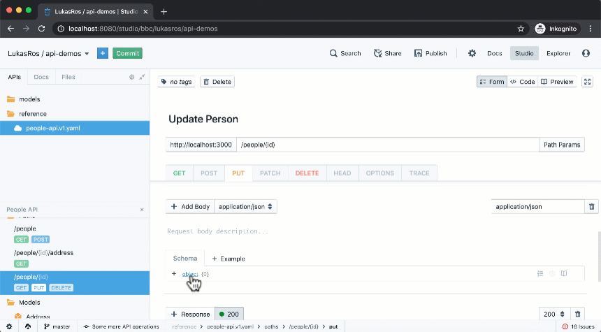

# How to Leverage the Design Library to Save Time and Promote Consistency

The Design Library is a feature of the Stoplight Enterprise Platform, which allows you to use common models, not just within an API, but share them among all APIs in your company. This article explains why you may want to do that, how to add models to the library, and how to reference them in other APIs.

## Advantages for Using the Design Library
Consistency is one of the critical factors in good API design and a cornerstone of excellent developer experience. By sharing Models among different APIs in an organization, developers working on or with more than one API are immediately familiar with the structure and semantics of the data and thus more productive.

> To learn more about the advantages and how to make the most of them, follow the [Stoplight Blog](https://stoplight.io/blog/), where we regularly discuss best practices for API design and how to establish them in your organization.

## Differences Between Explorer, Stars, and the Design Library
Before using the Design Library, it is essential to understand these concepts of the Stoplight Platform.

The **Explorer** tab shows you all the APIs, Endpoints, Models, and Articles across all your projects and allows you to search through them.

> Please note that a project needs to meet the following prerequisites before anything from that project appears in the Explorer:
> - The project is connected to a Git repository. Content from local projects will not show up in Explorer until it is connected to a VCS repository.
> - You have committed your changes to the repository and published docs for the project.

You can **Star** anything inside Explorer and then choose **Starred** as a filter. It works similarly to the star, favorite, or bookmark feature in your browser or on your favorite website. This functionality helps you highlight the APIs, Models, and Articles that are most important to you. Starred items are user-specific, so stars only impact your view of Explorer.

Like Stars, the **Design Library** is a subset of Explorer. However, it can contain *only* Models. You can use the Design Library as a filter on the Explorer tab, similar to Starred items. Adding a Model to the library explicitly marks it as designed for reuse and available within Studio for the entire organization.

> Even though you can browse everything in the Explorer and organize your overall content with Stars, only Models added to the Design Library can be referenced from other projects.

## Adding Models to the Design Library
As explained in the previous section, the Design Library is a subset of Explorer. Thus, make sure to meet the prerequisites explained above before you add a Model to it.

While you can browse the Design Library from the Explorer tab, you need to open the designated Design Library view to add Models.

To start, click on the **user** icon in the top right corner and choose the **Design Library** option from the menu.

 

The Design Library view shows you all Models in your projects, not just those in the library. Still, each Model is tagged to indicate whether it is part of the library or not. You can use the Starred or Design Library filters or use the search function to limit the number of Models shown in the view.

To add or remove a Model from the library, click the **Edit** button on the left side to toggle Edit mode.

Once you're in Edit mode, check boxes appear on the left side of each Model. To add a Model, check its box. To remove it, uncheck it. Changes apply immediately. Click **Stop Editing** to exit Edit mode.

## Referencing Models from the Design Library in an API
Referencing Models from the Design Library works similar to referencing Models within the same project, as Stoplight leverages and extends the $ref functionality in OpenAPI and JSON Schema. Wherever you can use $ref, you can use a Model from the library, too. That means you can use them for API requests and responses and even as part of other Models. You can also use them in local projects.

In the JSON Schema editor, click on a data type (e.g., object, string). In the popup, change the type to **$ref**.

Now you see the *$ref* Target selection. Click on the drop-down (which defaults to *This Project*) and change to **Design Library**.

Now click in the textbox that says "search". A list of Models in the Design Library will appear. You can click on any of the Models to add a reference to it. If the list is too long, enter a few characters from the Model name to narrow down the selection.

After adding the reference, click outside the popup to close it.

You can switch to the **Preview** tab to see the fields of the referenced Model.

## Leveraging Masking to Import Partial Models
Masking is a feature that allows you to reference another Model, even if you don’t need all fields from that Model. You can disable parts of the Model while at the same time keeping the reference to the standard schema. As an additional feature, you can modify whether the fields from the referenced Model are required or optional.

> Before you can use Masking, add a reference to a Model from the Design Library, as explained in the previous section.

You’ll notice that the schema editor has changed, and a new icon appears on the right side of the reference. Click this icon to open the mask editor popup.

Inside the mask editor, you can see the full referenced Model with all fields. You have the following options:

- Click any of the check-boxes that appear on the right side. The fields that you have checked are used for the new Model, the unchecked fields are removed. If all fields are unchecked, however, the entire Model is referenced without a filter.
- Click the (!) icon on the right side of the field to change whether the field is required or optional. The icon cycles through three states:
  - Gray (“inheriting”): The field requirement is inherited from the referenced Model.
  - Red (“forcing not required”): The field requirement is always optional, regardless of what the referenced Model says.
  - Green (“forcing required”): The field requirement is always required, regardless of what the referenced Model says.

Click the **Update Mask** button to apply the changes and close the popup.

You can also click **Clear Selection** to remove the whole mask and reset the new Model to the state of the referenced Model without changes.