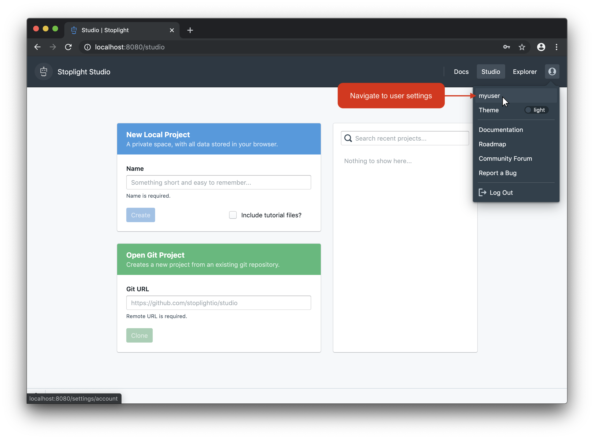
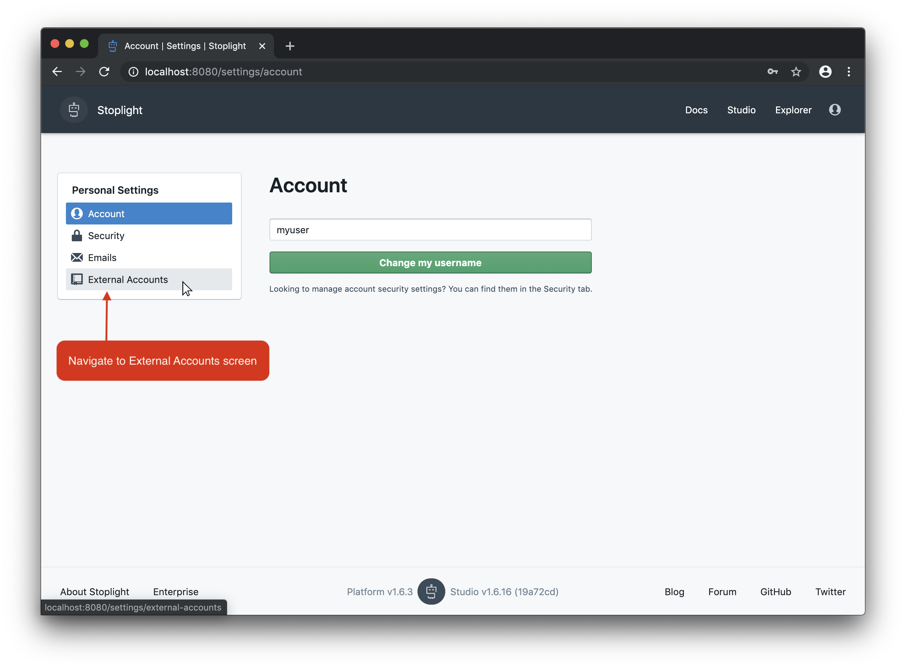
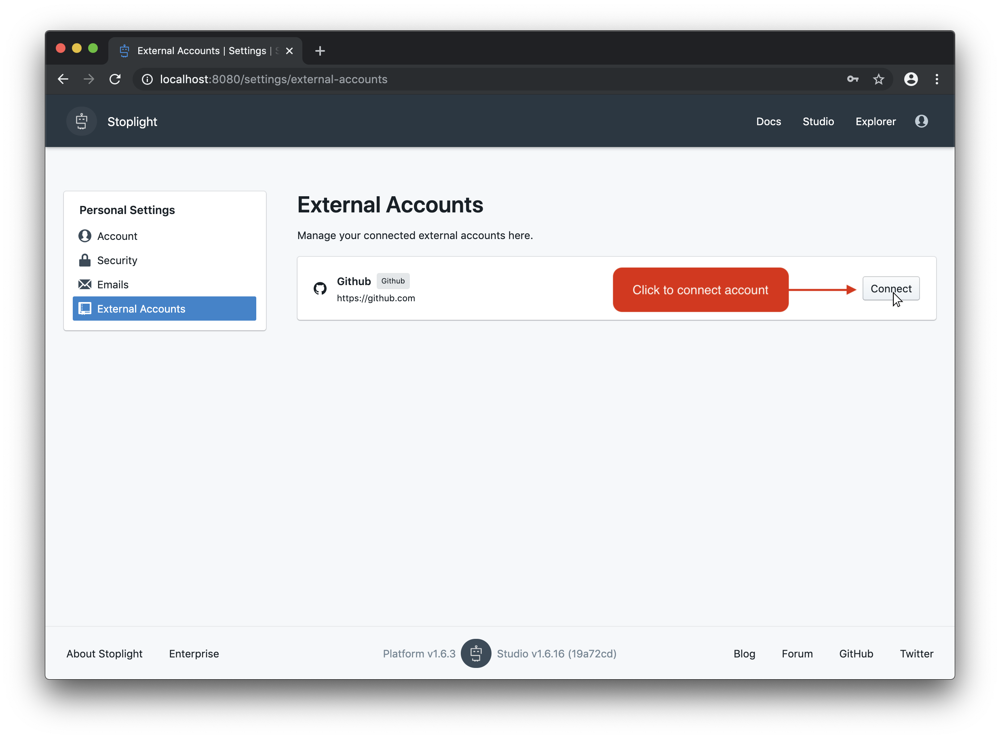

# How to Connect Your Stoplight User with an External Account

This article discusses how to synchronize your user in Stoplight with an account from an external service, like Github. Connecting your account allows you to access resources from the external service with your account credentials.

To get started, click on the profile icon at the top-right of the screen. This will display a drop-down, where you can then select your username to access your user settings.

From the user settings screen, click on **External Accounts** in the left-hand navigation.

The External Accounts screen should list all of the available External Services to connect to. Choose **Connect** to connect your account with the service.

After clicking **Connect**, you should be directed to a login for that service where you can then input your user credentials. Once completed, your account will be connected.

<!--theme: success-->
> ## Next Steps
Now that you've connected your account, continue to [Getting Started with Studio](https://support.stoplight.io/hc/en-us/articles/360037246471) to verify that you can properly clone and push data to your repositories.