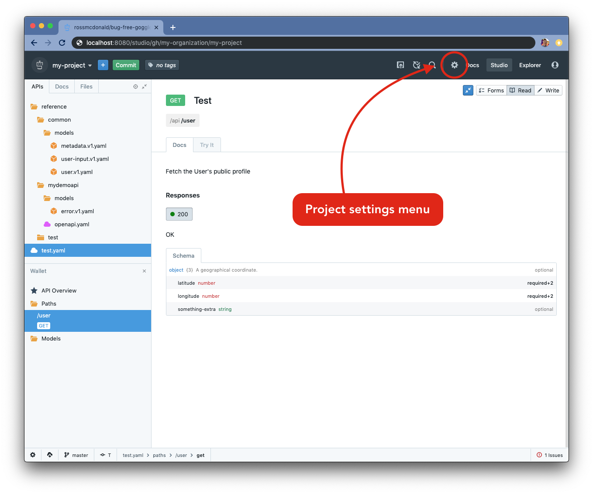
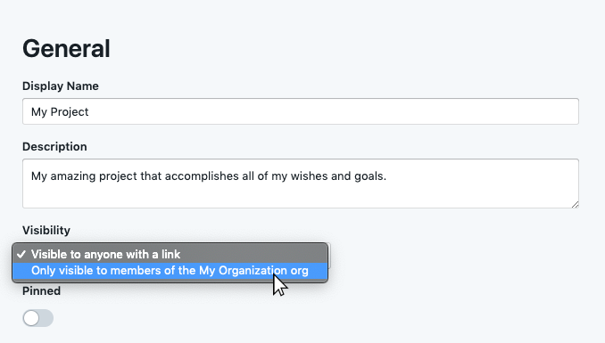

# How to Control Project Documentation Visibility

This article discusses how to manage and control visibility for published documentation.

To update the visibility settings for a project, the first thing you'll want to do is navigate the **project settings** screen using the cog wheel at the top right of the Studio editor.

Once within the project settings, you can customize the **Display Name**, **Description**, as well as the **Visibility** of the project.

> By default, project access is limited to whomever can access the backing Git repository of the project. For example, if your project was cloned from a private Github repository, only collaborators of the repository in Github (or members of your organization) will be able to access the published documentation.

To update the project **Visibility**, use the selector to choose the new visibility settings. At the moment only two settings are allowed:

- *Visible to anyone with a link* - This will make the project documentation **public**, allowing for anyone with a link to view the published project documentation.
- *Only visible to members of the <group/organization> org* - This will make the project only visible to users of Stoplight that have connected their VCS account and who have access to the underlying Git repository. This is the default.

Once the desired project visibility is selected, don't forget to hit **Save** for the changes to persist!

> This functionality was added with **v1.4.0** release of Stoplight.