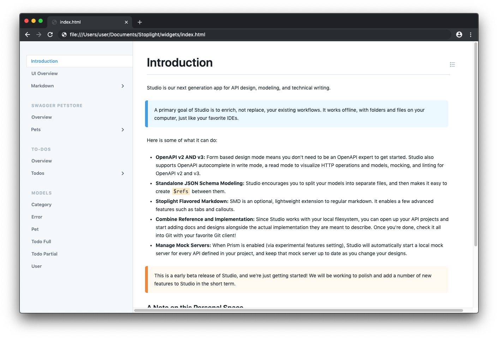

# How to Use Javascript Widgets to Embed Stoplight Content Into an Existing Site

Javascript widgets allow you to easily integrate Stoplight documentation into a larger, entirely separate web application. Read more below to find out how.



<!--theme: success-->
> **What You'll Need** <br>
> Before continuing, you'll need to have a project that has already been published in Stoplight. More specifically, you'll need the SRN of the project. The SRN is an identifier used by Stoplight to denote the external service, organization, and project name all in one. The quickest way to find the SRN is by navigating to the documentation of the project and viewing the URL. <br>
> For example, if the URL for your documentation is:
> ```
> https://stoplight.example.com/docs/gh/my-organization/my-project
> ```
> Then the SRN is: 
> ```
> gh/my-organization/my-project
> ```

# Loading the "Elements" Library
Add the following HTML to the header of your website, above the body. You'll want to make sure and add the script above other CSS of Javascript imports.

```html
<head>
  <!-- Stoplight Elements -->
  <link
   rel="stylesheet"
   href="https://stoplight.example.com/_next/static/elements/bundle.v1.css"
   media="print"
   onload="this.media='all'"
  />
  <script
   async
   defer
   src="https://stoplight.example.com/_next/static/elements/bundle.v1.js" onload="__onElementsLoad()"
  ></script>
  <script>
   function __onElementsLoad() {
     SL.config.host = 'https://stoplight.example.com/api';
     window.dispatchEvent(new Event('SL.ready'));
   }

   function openDrawer() {
     SL.elements.toc.options = { isOpen: true };
   }
  </script>
  <!-- End Stoplight Elements -->
</head>
```

<!--theme: warning-->
> Don't forget that you will need to replace the `https://stoplight.example.com` references in the example above with the URL of your Stoplight installation.

## The Global "SL" Object
Below is the interface declaration for the global **SL** variable, which is available on any page after the elements library has been loaded.

```javascript
declare namespace SL {
 interface IWidget {
   srn: string;
   render(htmlId: string, srn: string): void;
   remove(): void;
 }

 const createElement: any;

 const config: {
   host?: string;
   token?: string;
   components?: any;
 };

 const elements: {
   hub: IWidget;
   page: IWidget;
   toc: IWidget;
 };
}
```

## Rendering a Table of Contents
To render the Table of Contents element, use the 'SL.elements.toc.render' function:

```javascript
SL.elements.toc.render('my-container-element-id', projectSrn + '/docs/introduction.md');
```

<!--theme: warning-->
> Note, be sure to fill **projectSrn** with your project SRN, and replace `/docs/introduction.md` with the path to the file you would like to render.

The Table of Contents render function takes two arguments:

- The ID of the HTML element the Table of Contents should occupy
- The Stoplight SRN for the project to render a Table of Contents for


## Rendering a Page
To render the Page element, use the 'SL.elements.page.render' function:

```javascript
SL.elements.page.render('my-container-element-id', projectSrn + '/docs/introduction.md');
```

<!--theme: warning-->
> Note, be sure to fill **projectSrn** with your project SRN, and replace `/docs/introduction.md` with the path to the file you would like to render.

The Page render function takes two arguments:

- The ID of the HTML element the page should occupy
- The Stoplight SRN for the node (an article, API, model, HTTP operation, etc) to render a Page for

## Sample HTML
Below is an example HTML file that demonstrates the full flow. The file is also attached to this article as an attachment, which can be downloaded directly as needed.

```html
<html>
  <head>
  <!-- Stoplight Elements -->
    <link
      rel="stylesheet"
      href="http://localhost:8080/_next/static/elements/bundle.v1.css"
      media="print"
      onload="this.media='all'"
    />
    <script
      async
      defer
      src="http://localhost:8080/_next/static/elements/bundle.v1.js"
      onload="__onElementsLoad()"
    ></script>
    <script>
       function __onElementsLoad() {
         SL.config.host = 'http://localhost:8080/api';
         window.dispatchEvent(new Event('SL.ready'));
       }
       function openDrawer() {
         SL.elements.toc.options = { isOpen: true };
       }
    </script>
  <!-- End Stoplight Elements -->
  </head>
  <body>
    <div class="hidden sm:block my-6 mx-10">
      <button class="bp3-button" onclick="openDrawer()">
        <span class="bp3-button-text">Open Table of Contents</span>
      </button>
    </div>
    <div id="stoplight-hub" class="flex h-full h-screen w-full">
      <div id="stoplight-toc" class="border-r"></div>
      <div id="stoplight-page" class="flex-1 overflow-auto"></div>
    </div>

    <script>
      window.addEventListener(
       'SL.ready',
       () => {
         var projectSrn = 'gh/stoplightio/studio-demo';
         SL.config.components = {
           link: ({ node, children }) => {
             const href = /^http/.test(node.url) ? node.url : node.url.replace(projectSrn, '');
             return SL.createElement(
               'a',
               {
                 className: node.className,
                 title: node.title,
                 href,
                 onClick: function(e) {
                   if (!/^http/.test(node.url)) {
                     e.preventDefault();
                     history.pushState({}, node.title, href);
                   }
                 },
               },
               children,
             );
           },
         };
         (function(history) {
           var pushState = history.pushState;
           history.pushState = function(state, title, url) {
             SL.elements.page.srn = projectSrn + url;
             SL.elements.toc.srn = projectSrn + url;
             return pushState.apply(history, arguments);
           };
         })(window.history);
         SL.elements.toc.render('stoplight-toc', projectSrn + '/docs/introduction.md');
         SL.elements.page.render('stoplight-page', projectSrn + '/docs/introduction.md');
       },
       { once: true },
     );
   </script>
 </body>
</html>
```

<!-- TODO: Add download links -->