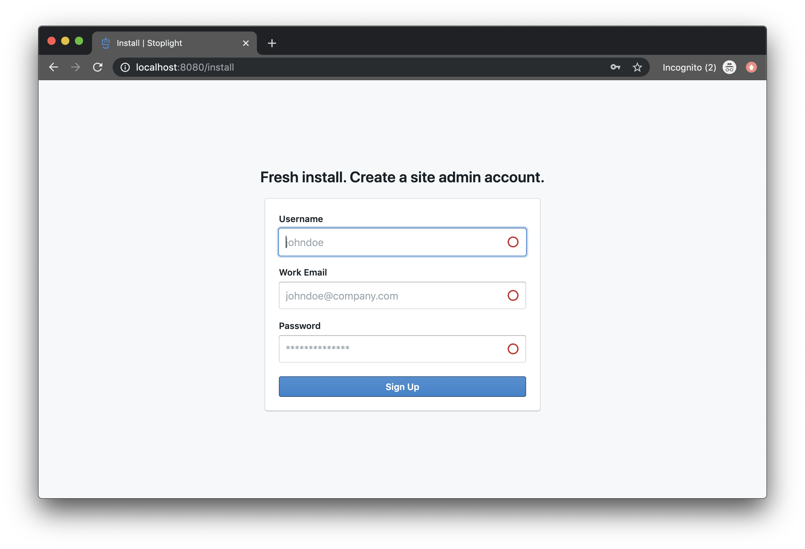
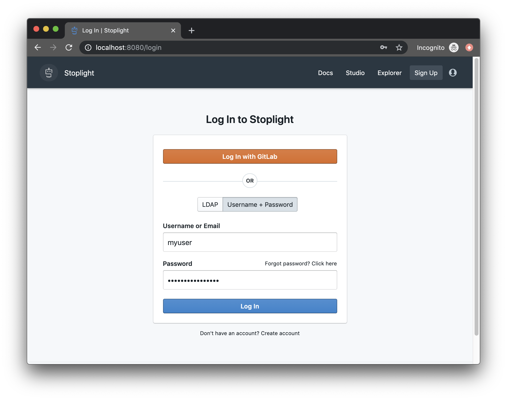

# Logging Into Stoplight

If you haven't already done so, the first thing you'll want to do is login to the Stoplight platform. For Stoplight's SaaS users, the Stoplight login is available at:

https://stoplight.io/p/login

For on premises or managed customers, you should have been provided a custom domain or address for accessing Stoplight.

> If you are unsure of how to access your instance of Stoplight, please contact your organization administrator or the Stoplight Support Team to get help.

## Initial Setup
If setting up Stoplight for the first time, you should be greeted with a "Fresh install" screen where you can input your initial username, email, and password.

> Don't worry if you plan on using Single Sign-On (SSO) or other authentication methods. Once the first user has been created, you can then configure alternative authentication methods (as well as disable the built-in username/password authentication method).

The first user will automatically be given administrative privileges on the system, as well as invite and promote other users to administrators.

## Logging in with External Services
<!--theme: warning-->
> **Wait!** Haven't configured an external service yet? See [here](https://support.stoplight.io/hc/en-us/sections/360006662551) to find out more on how to configure your external service of choice.

Stoplight allows you to configure your authentication methods, allowing you to enforce SSO with SAML/LDAP as well as to allow your users to authenticate with any of the available source control integrations (Github, GitLab, Bitbucket). You can even allow users to authenticate through multiple services at once if you have multiple sets of users needing access to Stoplight.

When multiple services are enabled, the login screen will provide an authentication option for each service.

The names of each service displayed on the login screen can be customized from the external services administration screen. See the configuration section for more information on how to configure the settings for external services.

<!--theme: success-->
> ## Next Steps
Now that you're familiar with how to access Stoplight, continue to Getting Started with Studio to get access to start designing APIs.
