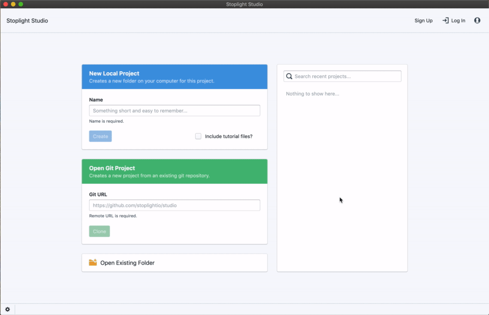

# Configuring Studio Desktop to use a Custom Instance of Stoplight

> In order to use Studio Desktop with a Stoplight instance that is on-premise or behind a custom domain, you will need to modify the Studio connection settings. Read more below to find out how.

To customize the Stoplight URLs:

- From the Studio landing screen, click the cog icon at the bottom left-hand corner of the screen to open the Studio settings menu.
- Within the Studio settings menu, modify the two "Stoplight Enterprise" URLs to point to the desired Stoplight instance.

> Usually (but not always) the only difference between the two URLs is that the Stoplight API URL should have a **/api** base path (ie, if Stoplight is accessed at http://stoplight.example.com, then the API URL will be http://stoplight.example.com/api). Please contact your Stoplight administrator if you have any questions on what these values should be set to.