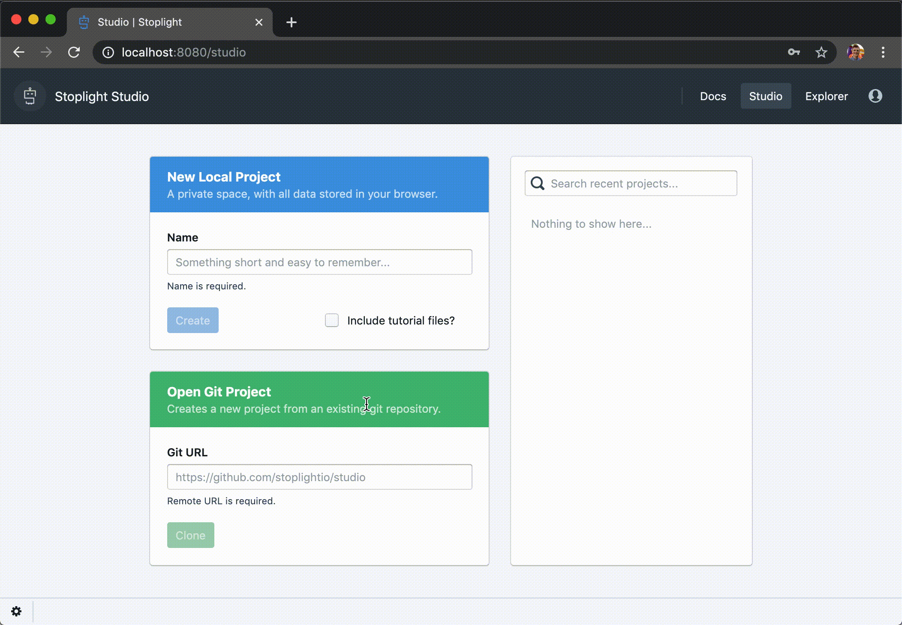
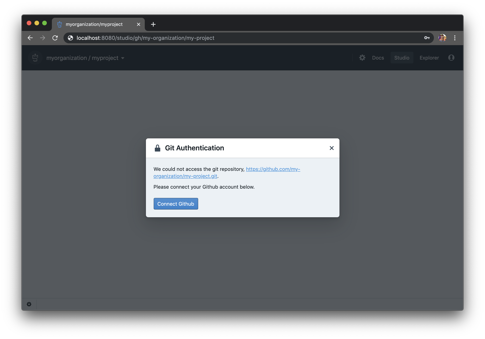
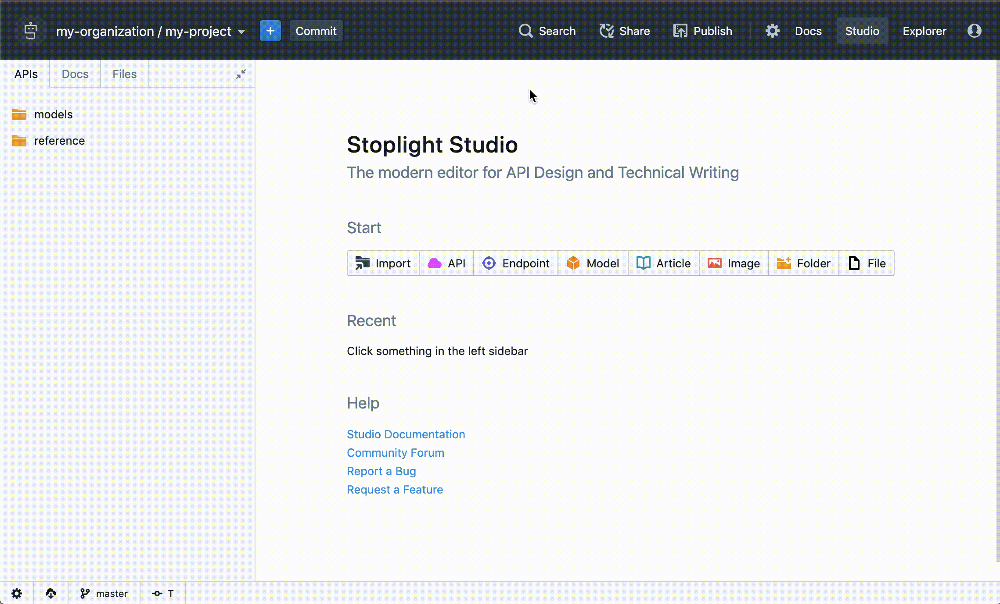
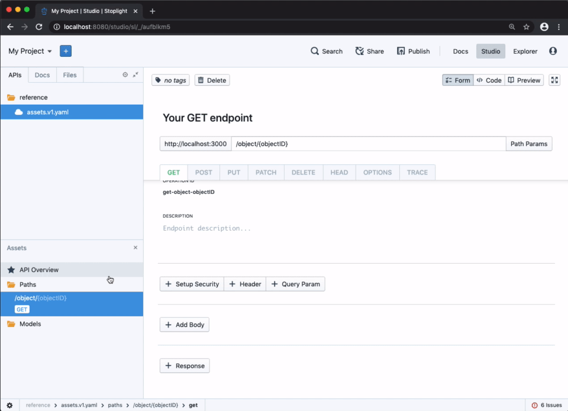
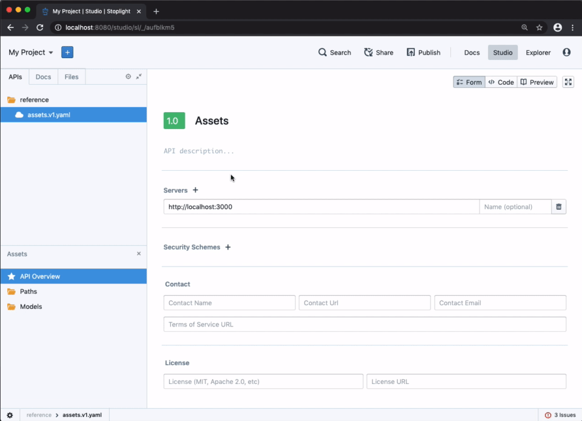
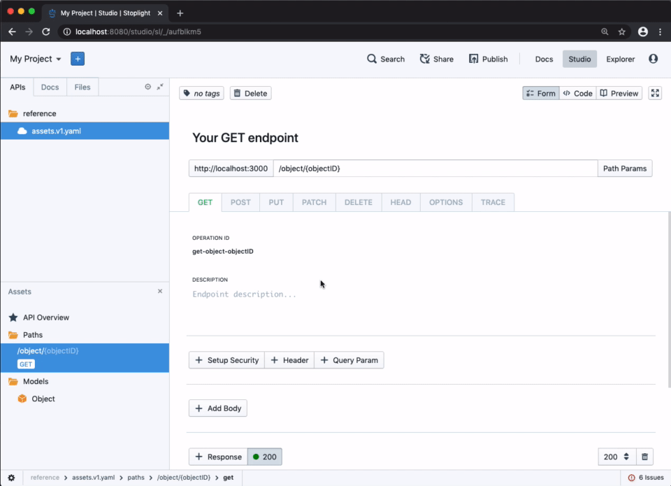

# Getting Started With Stoplight-Studio

Studio is Stoplight's next generation application for API design, modeling, and technical writing. A primary goal of Studio is to enrich, not replace, your existing workflows. When running locally it works fully offline, with folders and files on your computer just like your favorite IDE. When running in the browser, the web-native Git support allows you to effortlessly work with your existing repositories safely and efficiently.

## What You'll Need Before Continuing
Before continuing, you'll want to make sure you:

- Have access to an instance of Stoplight with a connected External Service. If you are using Stoplight's hosted service at stoplight.io, then github.com comes pre-configured.
- Have an existing Git repository to store data in. If you do not have a Git repository available, create one now. Make sure to note the Git HTTP URL for your repository, as you'll need it later.

## Cloning Your First Project
The quickest way to get up and running with Studio is to clone an existing Git repository. If you're running from the Studio desktop version, then this can be as easy as choosing a location on your computer where a repository already exists. If you're running from the browser, this can be as simple as pasting the HTTP Git URL to any Github repository that you'd like to add.

Paste the URL for your Git repository into the "Open Git Project" interface on the Studio landing screen and click "Clone" to open the project.

<!--theme: warning-->
> ### Unable to Clone?
If you have not connected your Stoplight account with your source control provider account, then you may see a "Git Authentication" error similar to the one below.

If this happens, all you need to do is click the "Connect ..." button to login with the external service provider.

## Creating an API
To create a new API, use the menu immediately next to the project name and select "API".

From there you can name your API, and then optionally set the specification version (OpenAPI v2 or v3) and storage format (JSON or YAML).

> Be sure to check with any other vendors or tools that you may be integrating with prior to settling on a specification version or format. While OpenAPI version 3 may be the latest available, some tools and vendors do not yet offer full support.

After clicking "Create", a new API description document will be created and added to the project. From there you can then set the global information about the API and get started adding your first operation.

## Creating Models
To create a model, right-click under the "Models" heading in the left-hand sidebar, select "New Model", and enter the desired name of the model to create. Once created, you can add and customize attributes to the model using the JSON Schema Editor that displays in the Form view.

## Creating an Endpoint
To create an endpoint, right-click under the "Paths" heading in the left-hand sidebar, select "New Path", and enter the desired path.

> Note that OpenAPI allows for specifying path templates by wrapping elements in brackets, ie `{myElement}`. This allows you to specify arguments in your path that will be substituted at run-time. For example, if you are creating a "users" endpoint, you may specify the path as `/users/{userName}` which tells OpenAPI that `{userName}` will be substituted for a real username when running.

## Crafting Requests and Responses
While having an endpoint is nice, it won't do much unless you actually accept and return data. When viewing an endpoint, you can modify the request and response structure by scrolling down in the Form view and adding security settings, header values, query parameters, and a request body. Further down, you will be able to modify and add responses, including adding response headers and modifying response objects using the JSON Schema editor.

<!--theme: success-->

> ## Next Steps
Now that you've created an API and are more familiar with Studio's Form editor, continue to **Publishing Documentation** to find out how to effortlessly generate an API reference for your project and make it available to other Stoplight users.